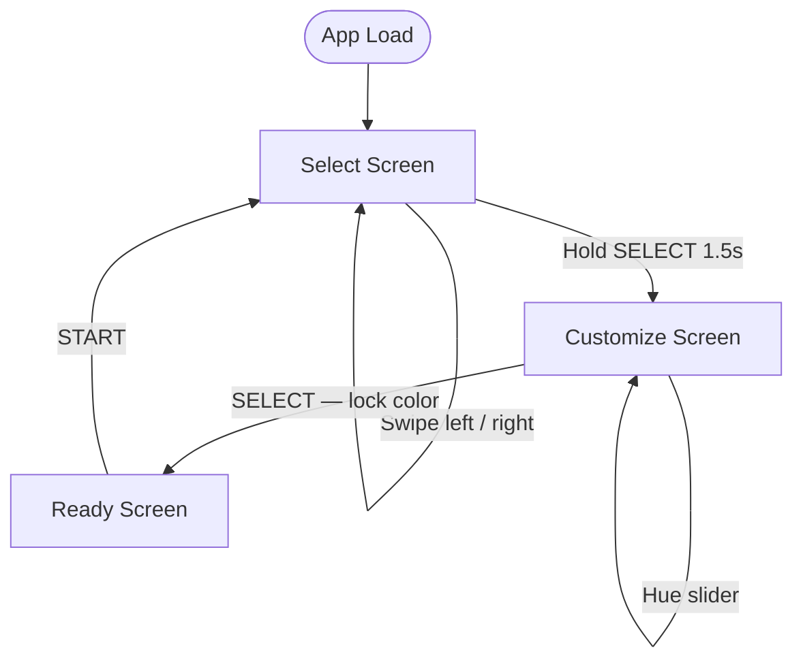

# Character Select Screen
**AI 201 — Project 1: The "Hero Faction" Screen**
**jasmlnebryant | Spring 2026**

Live URL: *(will be added after first deploy)*

---

## Design Intent

*(To be written by student before AI touches design code — Session 2 deliverable)*

**Concept**
An interactive (touchable, swipeable, selectable) hero selection IOS app screen for Edumon, a gamified educational (completeing subject specific quizzes, defeating bosses, and leveling up characters in order to gain in-game as well as real life experience) app for American high school students (in the first pass). Players choose their learning companion (a digital sci-fi animal pet) before the experience begins -- this is the screen we are building.

**Screen Title**
*"Choose who you will learn with"*

**Mood**
Cool, engaging, and snappy. Feels like a game, not a website. Designed for short attention spans — interactions are immediate and rewarding. For American high school students, "cool" can be described as Gen-Z meme culture, sports culture, & trendy/fun social connection.

**Color**
- Monochromatic values only — full color palette assigned once character designs are finalized.
- Let's start with 30 - 70% value.

**Typography**
- Headers / titles: 8-bit pixel font
- Body copy (sub-subjects, flavor lines): legible sans-serif
- Hierarchy / Purpose: the header is the largest font and is placed in the center at the top of the screen. The body copy sits below the header and is only 60% of its size. 

**Layout**
Three companions displayed side by side horizontally. No routing, no backend — single page.

**The Three Companions**

| Name | Subject | Sub-Subjects | Mood | Flavor Line |
|------|---------|--------------|------|-------------|
| Vexor | Math | Algebra, Geometry, Calculus | Fierce | *"Precision is power."* |
| Atomix | Science | Biology, Chemistry, Physics | Bubbly / Playful | *"Every answer is an experiment."* |
| Archaeon | History | World History, US History, Government | Steampunk | *"The past is a puzzle waiting to be solved."* |
The images of each companion will not be generated through you. I will provide the images at a later time, instead for now use placeholder images. The aspect ratio of the companion art will be 1:1. 

**Hover Behavior**
- Hovered hero: expands, takes focus
- Unhovered heroes: slide partially off-screen
- Background: 40% blur activates on hover
- Transition speed: snappy, game-like

**Selection Behavior**
- Selected hero: remains, dominates the screen
- Unselected heroes: disappear

**What I will not compromise on**
- 8-bit visual identity must be consistent throughout
- Transitions must feel instant and reactive — never sluggish
- Each hero must feel distinctly different in personality, not just name

---

## Production Pipeline

This project followed a 5-stage production pipeline. Stages 1–4 are complete. Stage 5 is in progress.

| Stage | Name | Status |
|-------|------|--------|
| 1 | Monochromatic Silhouettes | ✓ Complete |
| 2 | Base Colors & Companion Art | ✓ Complete |
| 3 | Idle Animation | ✓ Complete |
| 4 | Color Customization | ✓ Complete |
| 5 | Personality & Interaction | ✓ Complete |

### Stage 1 — Monochromatic Silhouettes
Carousel layout, typography hierarchy, and pixel background locked in greyscale. Cards sized to 169px, header and info panel positioned with consistent spacing. Foundation for all subsequent stages.

### Stage 2 — Base Colors & Companion Art
Three companions (Vexor, Atomix, Archaeon) with pixel art imported. Per-companion color tinting system built using CSS classes — applies to card, info panel, and SELECT button simultaneously. Dev toggle suite added (GRID, COLOR, VISIBILITY, CARDS). SELECT button added at the 760px grid line.

### Stage 3 — Idle Animation
Continuous float animation on the highlighted companion (`translateY(0 → -8px → 0)`, 3s, ease-in-out, infinite). Pure CSS keyframes — no JavaScript, no libraries. Vexor's art permanently scaled 15% via CSS `scale` property (kept separate from `transform` to avoid float animation conflict).

### Stage 4 — Color Customization
Full customization flow added. State machine: `select` → `customize` → `ready` → `select`. Hue slider (0–360°) with rainbow track. Hue filter formula: `(sliderValue - baseHue + 360) % 360`. Locked hue carries through to the ready screen. Alternate companion art for the ready screen (`readyImage` field per companion). Gaussian blur backdrop added behind companions on all screens.

### Stage 5 — Personality & Interaction
Visual polish and interaction layer complete. Unified button positions across all three screens, iPhone 16 Dynamic Island pill, "TIME TO START LEARNING!" ready screen, accessible color lifts on all companion accents, background opacity at 15%.

**Interactions added:**
- **Hold-to-confirm SELECT** — 1.5s hold fills the button with companion color (left→right), shake animation builds from imperceptible to aggressive over the same duration. Releasing early cancels cleanly.
- **Hold particles** — White dots spawn from the SELECT button while holding. Spawn rate accelerates and particle size grows as time progresses, building visual excitement.
- **START button pulsate** — Gentle scale pulse (0.8→0.84→0.8) on the ready screen button, 1.8s loop.
- **Hue hint animation** — On entering the customize screen, the slider sweeps to green and back over 2s to signal interactivity. Repeats every 20s if the user hasn't touched the slider. Stops permanently on first interaction.
- **Ambient particles on ready screen** — White particles continuously rise from behind the companion on the ready screen, layered between the blur backdrop and the companion image via z-index.
- **Smart animate screen transitions** — View Transitions API with `flushSync`. The companion image morphs between its position on each screen (carousel → customize → ready) automatically. Everything else crossfades at 0.35s.

---

## Companions

| Companion | Subject | Base Hue | Art |
|-----------|---------|----------|-----|
| Vexor | Magic / Spells | 280° | `vexor.png` / `vexor_seated.png` |
| Atomix | Science / Chemistry | 175° | `atomix.png` / `atomix_excited.png` |
| Archaeon | History / Artifacts | 38° | `archaeon.png` / `archaeon_reading.png` |

---

## Mermaid Diagram

---

## AI Direction Log

**Entry 1 — Hue slider target formula**
- Asked: Build a color picker slider that lets users choose any hue for their companion.
- AI produced: Slider that stored rotation delta — `hue-rotate(sliderValue)` directly — causing companions to land at the wrong color (e.g. Vexor at 60° became pink, not yellow).
- Decision: Revised formula to store *target* hue and compute rotation as `(targetHue - baseHue + 360) % 360`. Now the slider position visually matches the output color for all three companions.

**Entry 2 — Selective hue canvas for Atomix (scratched)**
- Asked: Isolate Atomix's green skin hue and leave the teal bubbles untouched during hue rotation.
- AI produced: `SelectiveHueCanvas.jsx` — canvas-based pixel processor with per-pixel RGB↔HSL conversion and hue range detection.
- Decision: Rejected. Too brittle and complex for the scope. Reverted to standard `hue-rotate` for all companions.

**Entry 3 — Centering on the ready screen**
- Asked: Vertically center the companion between the header and the START button.
- AI produced: `justify-content: center` on the full 844px screen — companion landed too high visually.
- Decision: Revised to padding-top/bottom approach to constrain the centering zone between header bottom and button top. Required two nudge passes to land correctly.

**Entry 4 — Confirmation overlay removal**
- Asked: Streamline the flow — the "ARE YOU SURE?" overlay feels unnecessary.
- AI produced: Removed confirmation overlay and its handlers; SELECT now goes straight to customize.
- Decision: Kept. Simpler flow, fewer taps.

**Entry 5 — Vexor scale + float animation conflict**
- Asked: Scale Vexor's art up permanently (it reads small compared to the other two).
- AI produced: First attempt used `transform: scale(1.15)` — conflicted with float animation's `transform: translateY()`.
- Decision: Revised to CSS `scale` property (separate from `transform`). Both coexist without overriding each other.

**Entry 6 — Hold-to-confirm shake animation**
- Asked: SELECT button should shake while being held, starting subtle and building excitement.
- AI produced (first attempt): Shake applied only to the label span — too subtle to notice.
- Decision: Revised — shake applied to the full button with the base transform baked into every keyframe. Amplitude grows from ±0.5px to ±7px across a single 1.5s arc that matches the fill duration exactly.

**Entry 7 — Smart animate screen transitions**
- Asked: "Smart animate" style transitions between screens, like Figma.
- AI produced: View Transitions API — `document.startViewTransition(() => flushSync(action))` with `view-transition-name: companion-hero` on the companion image across all three screens.
- Decision: Kept as-is. The browser automatically interpolates the companion's position and size between screens with zero manual math.

---

## Records of Resistance

**Resistance 1 — Text stroke on info panel type**
- What AI produced: `1px black -webkit-text-stroke` on subject and sub-subject labels.
- Why I rejected it: The stroke made small sans-serif text look heavy and chunky.
- What I did instead: Removed the stroke; used brighter accessible color values (`#d4b8f0`, `#9aded7`, `#e8c98a`) to improve legibility on dark backgrounds.

**Resistance 2 — Selective hue canvas**
- What AI produced: A canvas-based per-pixel hue filter to preserve Atomix's bubble color while shifting skin tone.
- Why I rejected it: Overly complex, brittle, and outside the scope of the project. The visual tradeoff wasn't worth the technical overhead.
- What I did instead: Stayed with standard CSS `hue-rotate` for all companions.

**Resistance 3 — Info panel space-between with wrong height**
- What AI produced: `height: 220px` with `justify-content: space-between` — the quote text shifted significantly downward.
- Why I rejected it: The quote position was already correct; the height was too large.
- What I did instead: Calculated the correct panel height (131px) that matched the original quote position, then applied `space-between`. Second attempt worked correctly.

**Resistance 4 — Shake animation on label only**
- What AI produced: Shake animation applied to the inner label `` — imperceptible at 3px offset on a small text element.
- Why I rejected it: The shake wasn't visible. The whole button needed to move.
- What I did instead: Moved the shake to the button itself with the full base transform (`translateX(-50%) translateY(-50%) scale(0.8)`) baked into every keyframe so the positioning wasn't overridden. Then changed it from constant amplitude to a building arc.

---

## Five Questions Reflection

*(Short paragraph completed before submission)*

1. **Can I defend this?** (Is this a solution I created?)

2. **Is this mine?** Before starting this project, I gave Claude my design intent and emphasized how I am the designer -- Claude was to simply follow my instructions. Because of this, I can confidently say that this Character Select Screen is mine, not Claude's. There were one or two times where I asked Claude for its opinion, but ultimately I decided whether or not it aligned with my design intent and was usable. 

3. **Did I verify?** (does it work)

4. **Would I teach this?** (vibe coding. human return questions)

5. **Is my documentation honest?** 
